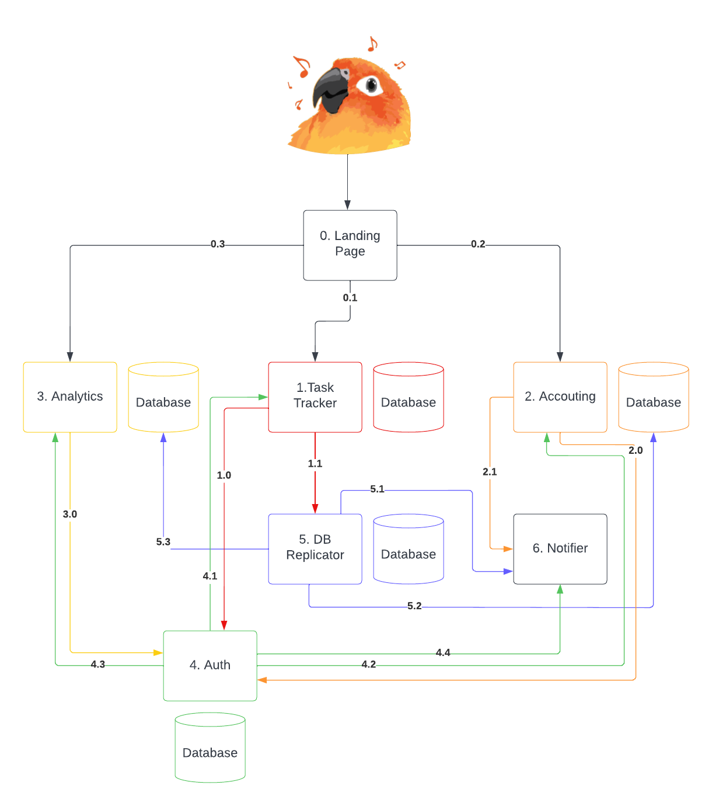

# Hometask 0

## Navigation

>>>
* [Вступительное слово](#вступительное-слово)
* [Схема](#схема)
* [Сервисы](#сервисы)
  * [0. Landing Page](#0-landing-page)
  * [1. Task Tracker](#1-task-tracker)
  * [Virtualenv](#virtualenv)
  * [Cloning and setting up the application](#cloning-and-setting-up-the-application)
  * [Deploy](#deploy)
  * [5. DB Replicator](#5-db-replicator)
>>>

## Схема

## Вступительное слово

К сожалению, опыта построения асинхронной архитектуры не имею, поэтому делал как умею, просто, синхронно,
заложив некоторые возможности масштабирования в будущем и некоторую отказоустойчивость.

## Сервисы

Всего сервисов получилось 7 (0-6), на картинке они пронумерованы, а стрелочки также пронумерованы для удобства описания приницпа работы.

### 0. Landing Page

uberpopug.com
Просто HTML страничка со ссылками на основные сервисы: 

1. Task Tracker - tasktracker.uberpopug.com
2. Accounting - accounting.uberpopug.com
3. Analytics - analytics.uberpopug.com

Ничего тут не происходит, никакой авторизации, никаких передач данных, ничего.

### 1. Task Tracker

Тут у нас логика по созданию, закрытию задач, их реассайну.
На каждое действие вешаем декоратор @auth_required, который проверяет, что пользователь авторизован (в противном случае происходит редирект на сервис аутентификации 4. Auth) и @has_perm - проверяющий, что у пользователя есть пермиссии это действие выполнить (сотрудник не может реассайнить и создавать задачи и т.д.).

Данные:
В БД три таблицы - пользователи (username, role), пермиссии (can_add / can_reassign / ...) и таски (name, status, price, ...).

Взаимодействие с другими сервисами:
1.0: Аутентификация - описано выше
1.1: Передача данных в репликатор - сюда передаем данные для Аккаунтинга и Аналитики - по двум действиям - ассайну на сотрудника и закрытию задачи (user_id, type (assign/close), price)

*Важно!*
Рекомендую сразу перейти к [5. DB Replicator](#5-db-replicator), а потом вернуться - так будет понятнее.

### 5. DB Replicator

Смысл сервиса в том, чтобы иметь основную копию базы, которая будет реплицироваться пока что на два сервиса - Аналитику и Аккаунтинг (может потом еще добавятся?). По сути это мастер-база, с версионностью и простой логикой - можно сделать на Go с рутинками - раз в n sec клонировать базу в связанные сервисы, если успех - супер, если нет - отправляем нотификацию администраторам системы - отсюда связь с Notifier (поэтому он и вынесен в отдельный сервис).

Поскольку для Аналитики и Аккаунтинга нам нужно только читать данные - мы делаем такое разделение. Плюс - если отвалится какая-то база - у нас будут реплики + мы всегда сможем восстановиться с мастер базы и т.д.

